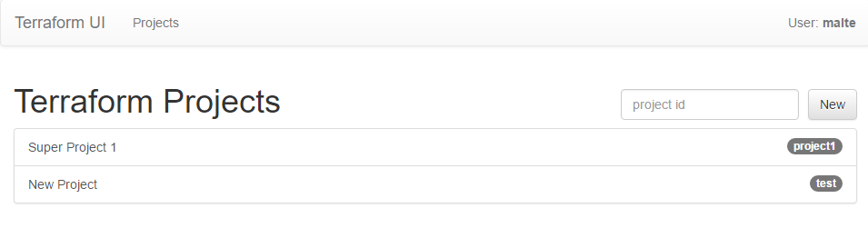
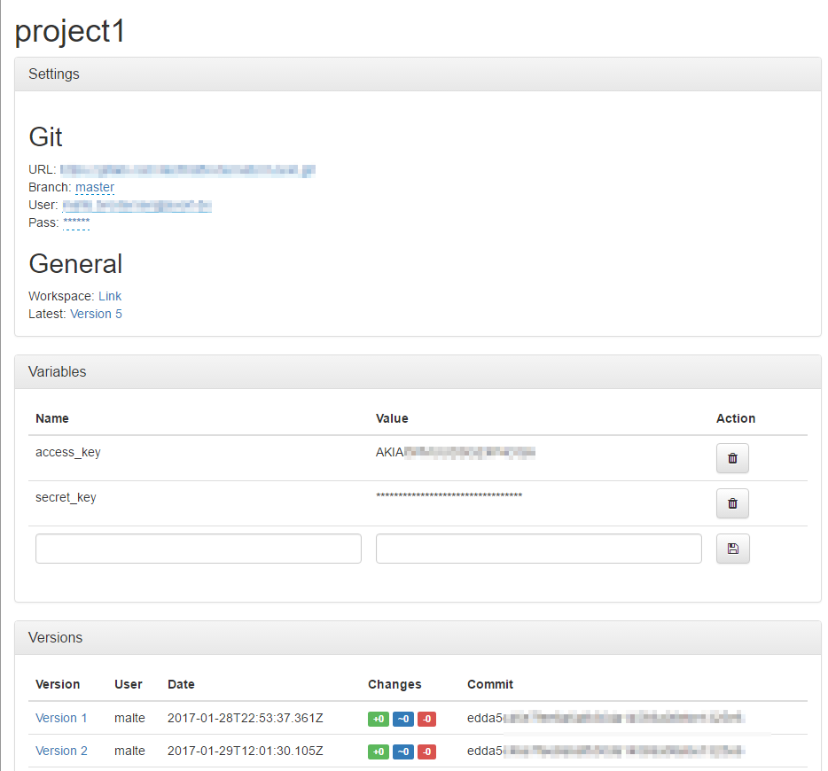
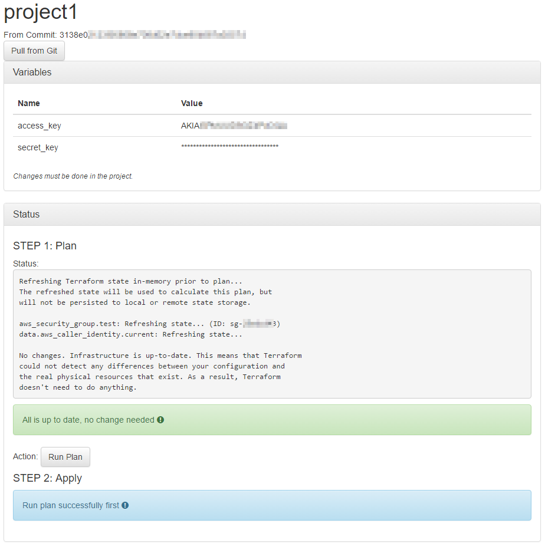
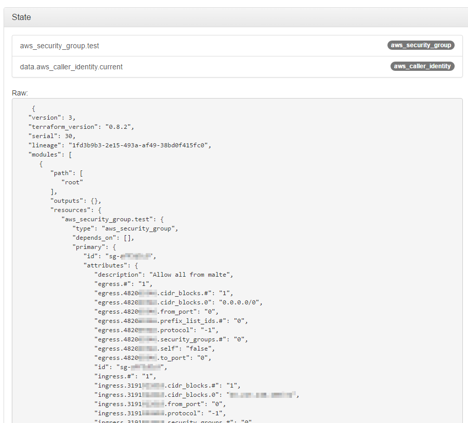

# About
Terraform UI is weekend project to provide a simple UI for the great terraform binary. Sadly this is special for new users a limit. Also the state sharing is a problem which should be addressed by this tool.

## Features
- Allows to exec terraform via web UI
- Support for multiple git backed projects
- Variables are stored on the webserver (try to hide secret data)
- History of executions is stored incl. State and changes
- (Tries to) follow the [ROCA Style](http://roca-style.org/)

## Images
### Project list
  
### Project details

### Project workspace

### Project version details



# Installation
- Clone the git repo
- Download the latest terraform binary and store it under bin/terraform (currently only windows tested!)
- start the app with ```node index.js```
- Go to ```http://localhost:3000```

# ToDo
- [ ] Clear code to have it more logical
- [ ] Add some unit tests (mocha & chai)

# Ideas
- Allow workspace to be located on aws-s3
- Add additional authentication providers
- Add permission system
